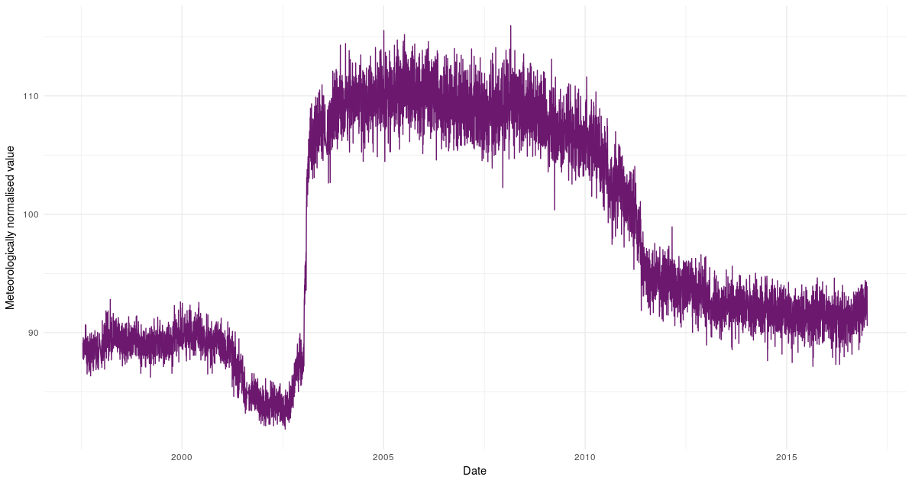

# **rmweather**

[](https://travis-ci.org/skgrange/rmweather)

## Introduction

**rmweather** is an R package to conduct meteorological/weather normalisation on air quality so trends and interventions can be investigated in a robust way. For those who are aware of my previous research, **rmweather** is the "Mk.II" package of [**normalweatherr**](https://github.com/skgrange/normalweatherr). **rmweather** does less than **normalweatherr**, but it is much faster and easier to use. 

## Installation

To install the development version the [**devtools**](https://github.com/hadley/devtools) package will need to be installed first. Then:

```
# Load helper package
library(devtools)

# Install rmweather
install_github("skgrange/rmweather")
```

The lightweight [**ghit**](https://github.com/cloudyr/ghit) package (soon to be replaced with [**remotes**](https://github.com/r-lib/remotes)) can also be used for installation if you prefer: 

```
# Install rmweather
ghit::install_github("skgrange/rmweather", INSTALL_opts = "--install-tests")
```

### Unit testing

After installation, you may want to perform the package's unit tests to ensure everything is behaving as expected:

```
# Conduct all unit tests
testthat::test_package("rmweather")
```

## Example usage

**rmweather** contains example data from London which can be used to show the meteorological normalisation procedure. The example data are daily means of NO<sub>2</sub> and NO<sub>x</sub> observations at London Marylebone Road. The accompanying surface meteorological data are from London Heathrow, a major airport located 23 km west of Central London. 

Most of **rmweather**'s functions begin with `rmw_` so are easy to track and find help for. In this example, we have used **dplyr** and the pipe (`%>%`) for clarity. The example take about a minute on my (laptop) system and the model has an *R<sup>2</sup>* value of 79 %. 

```
# Load packages
library(dplyr)
library(rmweather)

# Load rmweather's example data, from london
data_example <- rmw_example_data()

# Prepare data for modelling
# Only use data with valid wind speeds, no2 will become the dependent variable
data_example_prepared <- data_example %>% 
  filter(!is.na(ws)) %>% 
  rename(value = no2) %>% 
  rmw_prepare_data()

# Grow/train a random forest model and then create a meteorological normalised trend 
list_normalised <- rmw_do_all(
  data_example_prepared,
  variables = c(
    "date_unix", "day_julian", "weekday", "air_temp", "rh", "wd", "ws",
    "atmospheric_pressure"
  ),
  n_trees = 300,
  n_samples = 300,
  verbose = TRUE
)

# What units are in the list? 
names(list_normalised)

# Check model object's performance
rmw_model_statistics(list_normalised$model)

# Plot variable importances
list_normalised$model %>% 
  rmw_model_importance() %>% 
  rmw_plot_importance()

# Check if model has suffered from overfitting
rmw_predict_the_test_set(
  model = list_normalised$model,
  df = list_normalised$observations
) %>% 
  rmw_plot_test_prediction()

# How long did the process take? 
list_normalised$elapsed_times

# Plot normalised trend
rmw_plot_normalised(list_normalised$normalised)

# Investigate partial dependencies, if variable is NA, predict all
data_pd <- rmw_partial_dependencies(
  model = list_normalised$model, 
  df = list_normalised$observations,
  variable = NA
)

# Plot partial dependencies
data_pd %>% 
  filter(variable != "date_unix") %>% 
  rmw_plot_partial_dependencies()
```

The meteorologically normalised trend produced is below: 



## See also

  - [**ranger**](https://github.com/imbs-hl/ranger)
  
  - [**normalweatherr**](https://github.com/skgrange/normalweatherr)
  
  - [**deweather**](https://github.com/davidcarslaw/deweather)
